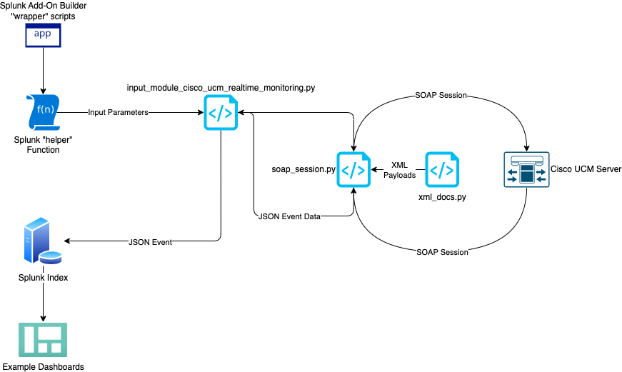

# Application Design

As mentioned previously, this application allows Splunk to communicate with one (or more) Cisco UCM servers using their built-in Performance Monitoring API, which is a SOAP-based interface (i.e. a stateful API that exchanges data in XML format).  Splunk is capable of communicating with any external data source through the use of "Scripted Inputs", which can take the form of custom Python scripts or Shell scripts (Bash, Powershell, Batch files, etc.).  

For this application, we used the Python programming language to establish a SOAP session with Cisco UCM, configure counters, obtain their values, extract that data from XML format, and convert it into JSON format for insertion into the Splunk index.  JSON was chosen for its improved readability and Splunk's ability to easily extract fields and data from it.

## Table of Contents

* [Application Workflow](#application-workflow)
* [The Performance Monitoring API](#the-performance-monitoring-api)
    * [Using the API](#using-the-api)
    * [Example perfmonAddCounter XML Payload](#example-perfmonaddcounter-xml-payload)
    * [Example perfmonCollectSessionData Response](#example-perfmoncollectsessiondata-response)
* [App Files and Directories](#app-files-and-directories)
    * [The bin Directory](#the-bin-directory)
    * [The soap_session.py Script](#the-soap_sessionpy-script)
    * [The input_module...py Script](#the-input_modulepy-script)
    * [The appserver Directory](#the-appserver-directory)
    * [The default and local Directories](#the-default-and-local-directories)
    * [The props.conf File](#the-propsconf-file)
* [Example Dashboards](#example-dashboards)
    * [Cisco UCM Counters Dashboard](#cisco-ucm-counters-dashboard)
    * [Cisco UCM System Performance Dashboard](#cisco-ucm-system-performance-dashboard)
* [Documentation and Resources](#documentation-and-resources)

---

## Application Workflow



[Back to ToC](#table-of-contents)

---

## The Performance Monitoring API

Cisco Unified Communications Manager provides several APIs for configuring the platform and collecting data from it.  The Performance Monitoring API can be used to obtain the same data made available through Cisco's Real Time Monitoring Tool (RTMT) Java application.  RTMT and the Perfmon API provide the ability to establish a monitoring session, add monitoring counters to that session, and then collect the resulting data.  The Perfmon API uses the SOAP protocol and exchanges data in XML format.

### Using the API

Any application capable of making HTTP connections and exchanging data can interact with the Perfmon API.  Documentation on the API can be found [here](https://developer.cisco.com/docs/sxml/#!perfmon-api/session-based-performance-monitoring), [here](https://www.cisco.com/c/en/us/td/docs/voice_ip_comm/cucm/service/12_5_1/rtmt/cucm_b_cisco-unified-rtmt-administration-1251/cucm_mp_m4b3295d_00_manage-performance-counters.html) and [here](https://www.cisco.com/c/en/us/td/docs/voice_ip_comm/cucm/service/12_5_1/rtmt/cucm_b_cisco-unified-rtmt-administration-1251/cucm_mp_pfefd90a_00_performance-counters-and-alerts.html).

The base URL for the Perfmon API is:

```
https://<cucm_server>:8443/perfmonservice2/services/PerfmonService
```

The high-level procedure for using the API is as follows:

1. Authenticate to the Perfmon API and obtain a Session Handle ID using the [perfmonOpenSession request](https://developer.cisco.com/docs/sxml/#!perfmon-api/perfmonopensession).
    1. HTTP Basic Authentication method is used.
    2. Payload is exchanged in XML format.
2. The list of counters is added to the session (using the Session Handle from step 1) via the [perfmonAddCounters request](https://developer.cisco.com/docs/sxml/#!perfmon-api/perfmonaddcounter).
3. The counter values are requested from the session, using the [perfmonCollectSessionData request](https://developer.cisco.com/docs/sxml/#!perfmon-api/perfmoncollectsessiondata).
4. The session is closed using the [perfmonCloseSession request](https://developer.cisco.com/docs/sxml/#!perfmon-api/perfmonclosesession).

Payload models for each of these API methods are imported from the [`xml_docs.py`](bin/xml_docs.py) script, each time the script runs.  The Python [`requests`](https://pypi.org/project/requests/) package is used to send and receive the HTTP messages, and the [`lxml`](https://pypi.org/project/lxml/) package is used to parse and update the XML payloads.

[Back to ToC](#table-of-contents)

### Example perfmonAddCounter XML Payload

*perfmonAddCounter:*
```xml
<soapenv:Envelope xmlns:soapenv="http://schemas.xmlsoap.org/soap/envelope/" xmlns:soap="http://schemas.cisco.com/ast/soap">
   <soapenv:Header/>
   <soapenv:Body>
      <soap:perfmonAddCounter>
         <soap:SessionHandle>9830a5d4-48b1-11e4-8000-000c29ff920f</soap:SessionHandle>
         <soap:ArrayOfCounter>
            <soap:Counter>
               <soap:Name>\\10.209.1.3\Cisco CallManager\CallsActive</soap:Name>
            </soap:Counter>
            <soap:Counter>
               <soap:Name>\\10.209.1.3\Cisco CallManager\CallsAttempted</soap:Name>
            </soap:Counter>
            <soap:Counter>
               <soap:Name>\\10.209.1.3\Memory\% Mem Used</soap:Name>
            </soap:Counter>
         </soap:ArrayOfCounter>
      </soap:perfmonAddCounter>
   </soapenv:Body>
</soapenv:Envelope>
```

[Back to ToC](#table-of-contents)

### Example perfmonCollectSessionData Response

*perfmonCollectSessionData:*
```xml
<?xml version='1.0' encoding='UTF-8'?>
    <soapenv:Envelope xmlns:soapenv="http://schemas.xmlsoap.org/soap/envelope">
    <soapenv:Body>
        <ns1:perfmonCollectSessionDataResponse xmlns:ns1="http://schemas.cisco.com/ast/soap">
            <ns1:perfmonCollectSessionDataReturn>
                <ns1:Name>\\10.209.1.3\Cisco CallManager\CallsActive</ns1:Name>
                <ns1:Value>0</ns1:Value>
                <ns1:CStatus>0</ns1:CStatus>
            </ns1:perfmonCollectSessionDataReturn>
            <ns1:perfmonCollectSessionDataReturn>
                <ns1:Name>\\10.209.1.3\Cisco CallManager\CallsAttempted</ns1:Name>
                <ns1:Value>167</ns1:Value>
                <ns1:CStatus>0</ns1:CStatus>
            </ns1:perfmonCollectSessionDataReturn>
            <ns1:perfmonCollectSessionDataReturn>
                <ns1:Name>\\10.209.1.3\Memory\% Mem Used</ns1:Name>
                <ns1:Value>57</ns1:Value>
                <ns1:CStatus>0</ns1:CStatus>
            </ns1:perfmonCollectSessionDataReturn>
        </ns1:perfmonCollectSessionDataResponse>
    </soapenv:Body>
</soapenv:Envelope>
```

[Back to ToC](#table-of-contents)

---

## App Files and Directories

### The `bin` Directory

The `bin` subdirectory contains all of the Python scripts required for the application to function.  Several of the Python scripts in this directory are created automatically by the Splunk Add-On Builder application, and remain in their default state.  The only customized Python scripts are:

* `input_module_cisco_ucm_realtime_monitoring.py`
* `soap_session.py`
* `xml_docs.py`

[Back to ToC](#table-of-contents)

---

### The `soap_session.py` Script

The `soap_session.py` script provides a Python Class which defines a `PerfmonServiceSession` object.  It accepts one input argument - the Splunk `helper` Python function - and uses it to obtain the input configuration parameters (the Cisco UCM server IP or Hostname, API user account, list of Perfmon Counters, etc.).  This script, with the help of the `xml_docs.py` script (which contains the XML payload models for each Perfmon API endpoint), handles all of the API communication with Cisco UCM and also extracts the counter data from XML format, rewriting it in JSON format.

[Back to ToC](#table-of-contents)

---

### The `input_module...py` Script

The `input_module_cisco_ucm_realtime_monitoring.py` is provided by the Splunk Add-On Builder application, and it serves as the first user-editable entry point for a Splunk application built by the Add-On Builder.  This script is called by other scripts packaged with the application however, those scripts remain untouched from their original state, as provided by the Add-On Builder.

The `input_module...py` script serves two purposes:

1. Providing basic input validation for user-defined configurations when the application runs.  These are simple error checks that look for missing values or errors in formatting.  It also checks that the `lxml` Python package is installed.
2. Instantiates a `PerfmonServiceSession` object and executes all the necessary steps to obtain counter data from the Perfmon API.  It then builds a Splunk Event object with the returned data, and writes that Event to the appropriate Index.

[Back to ToC](#table-of-contents)

---

### The `appserver` Directory

The `appserver` directory contains Javascript files and configuration parameters which are used to customize the application's User Interface.  These scripts are automatically generated by the Add-On Builder app and they provide the Data Input and API user account Configuration web forms.  They store these configurations in the application's `local` subdirectory, where they are later conveyed to the application Python scripts, via the `helper` function.

The API User account credentials that users supply are stored in encrypted format in the `local/passwords.conf` file, within the application directory.  The encryption key is also stored locally on the Splunk server, so the level of security is not fool-proof but it is a vast improvement beyond simply storing credentials in plain text format (for more information, refer to the [documentation](https://dev.splunk.com/enterprise/docs/developapps/manageknowledge/secretstorage)).

In order to obtain the decrypted password and pass it along to the `helper` function, the application leverages the Splunk API; authentication to the Splunk API is also handled by these pre-built application scripts.

[Back to ToC](#table-of-contents)

---

### The `default` and `local` Directories

Application specific configuration parameters are stored in the `default` and `local` subdirectories, typically in plain text `.conf` files.  Prepackaged default application configurations (provided out-of-the-box) are kept in the `default` subdirectory.  When the application is installed and run for the first time, a copy of these `.conf` files are made and stored in the `local` subdirectory.  Any user-provided configuration changes will be written to the `local` subdirectory configuration files, and those files will remain untouched across application updates.  In this way, user configurations can be preserved at all times.

Any application user interface (UI) customizations are stored in XML files located in the `default/data/ui` subdirectory.  This includes application navigation (the tabs available in the app) and any Dashboards provided by default with the application.

[Back to ToC](#table-of-contents)

---

### The `props.conf` File

The `props.conf` file located in the `default` subdirectory defines the custom "sourcetype" for data indexed by this application.  The custom sourcetype is `cisco:ucm:perfmonAPI:json`, which follows the [recommended best practice](https://docs.splunk.com/Documentation/AddOns/released/Overview/Sourcetypes) naming convention of:

```
vendor:product:technology:format
```

The attribute settings for this sourcetype define how Splunk should interpret the incoming event data, and slice it into individual events.  They are essentially copied from the default `_json` sourcetype, with some minor modifications:

```
[cisco:ucm:perfmonAPI:json]
INDEXED_EXTRACTIONS = json
LINE_BREAKER = ([\r\n]+)
NO_BINARY_CHECK = 1
category = Structured
description = Cisco UCM Performance Monitoring Counters (JSON)
pulldown_type = 1
```

The `INDEXED_EXTRACTIONS = json` attribute informs Splunk that the incoming event data is in JSON format, that it should be parsed as JSON at the time of indexing, and that all JSON keys should be extracted as "fields" for the resulting events.

[Back to ToC](#table-of-contents)

---

## Example Dashboards

We have included two example dashboards with this application, which demonstrate some of the capabilities Splunk provides for visualizing event data.  You will find those dashboards listed under the **"Dashboards"** dropdown menu tab once you've installed the application in Splunk.

> ***Note:** The **"Dashboards"** dropdown menu tab is configured to dynamically include any dashboard within the app, whose name begins with `cisco_ucm`.  If you create a new dashboard and begin the name with `cisco_ucm`, it should appear automatically in the **"Dashboards"** dropdown menu.*

### Cisco UCM Counters Dashboard

The "Cisco UCM Counters" dashboard displays visualizations based on the values chosen in each of the five filter dropdown menus, located across the top.  Visualizations include:

* The number of counters that returned an error status (`cstatus` value NOT equal to 0 or 1)
* The number of Calls Completed (from the `Cisco CallManager\CallsCompleted` counter)
* The number of Calls In Progress (from the `Cisco CallManager\CallsInProgress` counter)
* A filtered table of events resulting from the dropdown values chosen

To understand how these visualizations are created and how the filter dropdowns are configured, you can:

1. Edit the dashboard
2. Click on any visualization or dropdown picker
3. Locate the "Data Source" section of the configuration panel
4. Click on the pencil icon to edit the Data Source search  

The Data Source for each visualization and dropdown picker is derived from a Splunk Search Processing Language (SPL) query.  The values chosen via the dropdown picker menus are passed to other SPL searches in other dropdowns, or in visualizations, via a "Token name" (effectively, a variable that can be used in SPL queries).  Through this process, visualizations and dropdown picker menus can be dynamically linked to other values on the dashboard, which causes output to be filtered on-the-fly.


[Back to ToC](#table-of-contents)

---

### Cisco UCM System Performance Dashboard

The "Cisco UCM System Performance" dashboard displays visualizations based on the following counters:

* `Memory\% Mem Used`
* `Processor\% CPU Time`
* `Cisco CallManager\CallsInProgress`


[Back to ToC](#table-of-contents)

---

## Documentation and Resources

* [Cisco UCM Performance Monitoring API](https://developer.cisco.com/docs/sxml/#!perfmon-api)
    * [Getting Started](https://developer.cisco.com/site/sxml/learn/getting-started/perfmon/)
* [Splunk Add-On Builder Guide](https://docs.splunk.com/Documentation/AddonBuilder/4.1.4/UserGuide/Overview)
    * [Python Helper Function](https://docs.splunk.com/Documentation/AddonBuilder/4.1.4/UserGuide/PythonHelperFunctions)
* [Developing Splunk Apps](https://dev.splunk.com/enterprise/docs/developapps)
* [Splunk App Examples](https://github.com/splunk/splunk-app-examples)
* [Splunk Dashboard Studio](https://docs.splunk.com/Documentation/Splunk/9.2.0/DashStudio/IntroFrame)

[Back to ToC](#table-of-contents)
