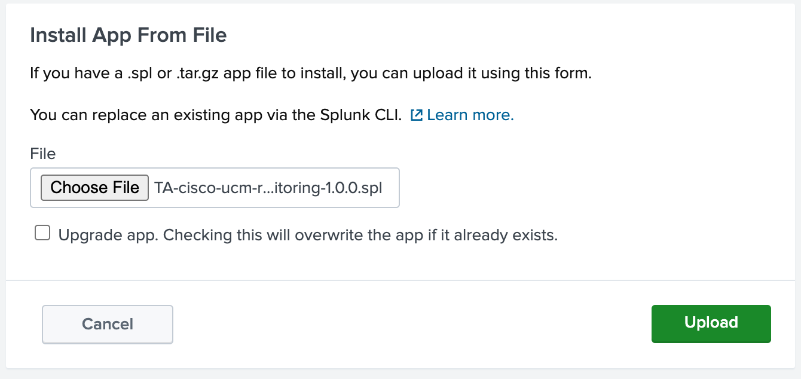
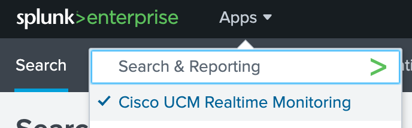
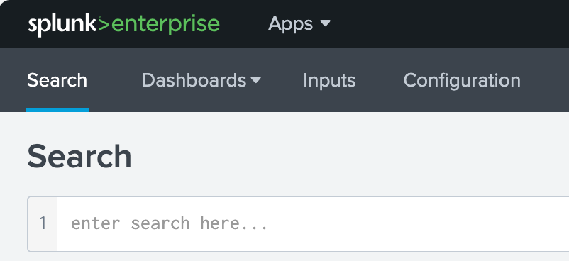
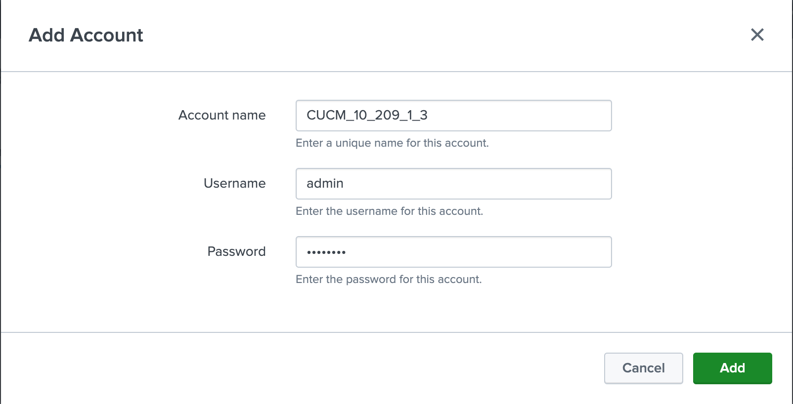
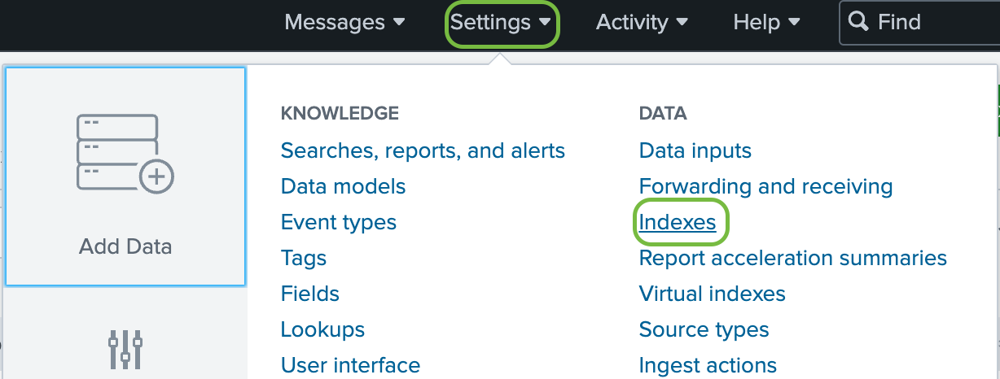
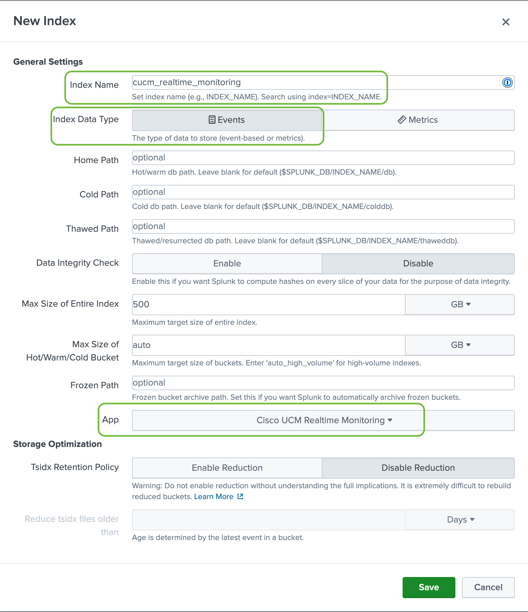
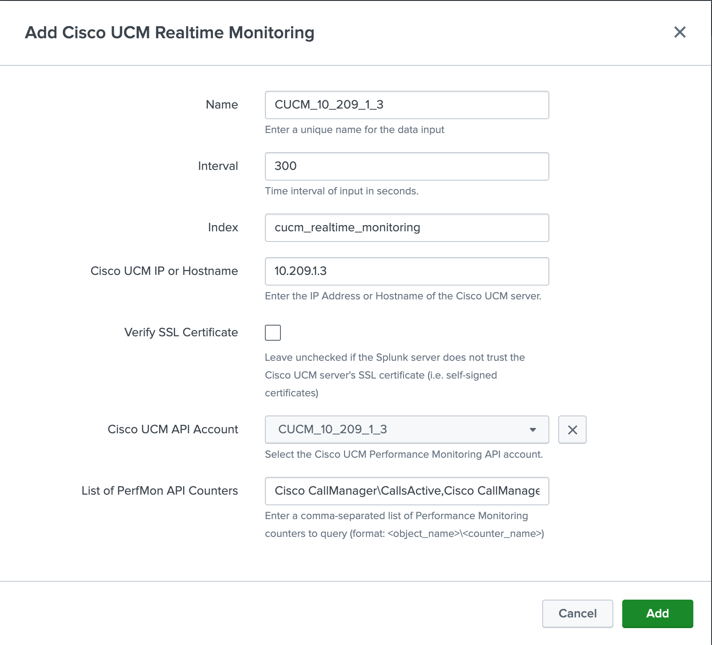
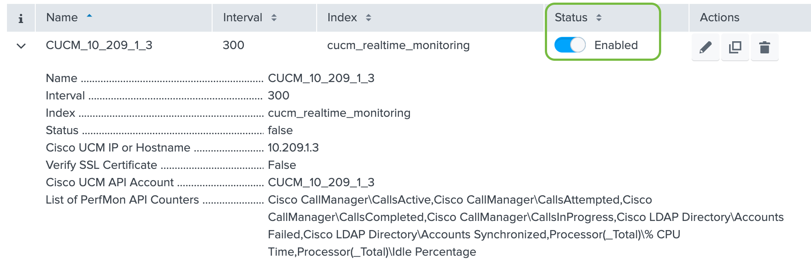
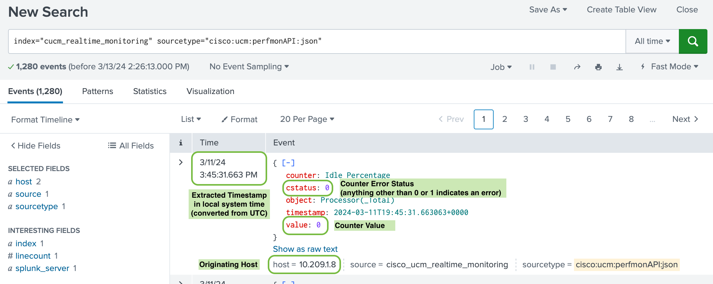

# Cisco UCM Realtime Monitoring Splunk App

This project contains a custom-built Splunk Application which has the following capabilities:

* Communicates with the Cisco Unified Communications Manager (UCM) Performance Monitoring SOAP API
    * Multiple Cisco UCM servers can be monitored from this single application
* Collects performance counter data from a list of counters (specified by the user) and converts it from XML to JSON format
* Inserts the JSON-formatted counter data into a Splunk Index (specified by the user)
* Includes example Splunk Dashboards which help to filter and visualize the ingested counter data

The purpose of this project is two-fold: 

1. Provide an example of how to build a custom Splunk application which can obtain data from an API, transform it, insert it into a Splunk Index and visualize that data using custom Dashboards.
2. To provide an alternative to the Cisco Real Time Monitoring Tool (RTMT), a Java-based client application for monitoring real time statistics from Cisco UCM, for customers which either can not use or do not want to use Cisco's Cloud Connected UC solution.

## Table of Contents

* [Compatibility](#compatibility)
* [Application Design](#application-design)
* [Installation](#installation)
* [Initial Setup](#initial-setup)
    * [Create an API Account](#create-an-api-account)
    * [Create an Index](#create-an-index)
    * [Create a New Data Input](#create-a-new-data-input)
* [Search For Events](#search-for-events)
* [Troubleshooting](#troubleshooting)
    * [The Log File](#the-log-file)
    * [Running the Script Manually](#running-the-script-manually)

---

## Compatibility

This application was built using Splunk's [Add-On Builder App](https://splunkbase.splunk.com/app/2962), which greatly simplifies the process of designing, testing and packaging custom Splunk applications.  It was built and tested on a Splunk Enterprise installation running on Ubuntu Linux 22.04, Server Edition; as such, **compatibility with Splunk Enterprise on a Windows OS was not tested** however, the scripts used in this application should be OS independent.  The scripts used in this application ***are NOT*** backward compatible with Python v2.x; you must use a version of Splunk Enterprise that includes Python v3.7 or higher.

The application was built and tested using Splunk Enterprise v9.1.2 however, the external Python packages used (`requests` and `lxml`) in this application are provided with the basic installation of Splunk and are documented to be available out-of-the-box from [Splunk Enterprise v8.1.0](https://docs.splunk.com/images/f/f6/Splunk_Enterprise_3rd_Party_Software_810_rev1.pdf) onward.

For more information on what external, 3rd party software packages are available in each version of Splunk Enterprise, refer to the Release Notes documentation, "Third-party software" section, "Credits" link.  The list of included 3rd party software is provided in PDF form from a hyperlink on that page of the Release Notes.

[Back to ToC](#table-of-contents)

---

## Application Design

For more detailed information on how this application was designed and how it functions, please review the [App_Design.md](App_Design.md) Markdown file.

[Back to ToC](#table-of-contents)

---

## Installation

We have provided a packaged version of this application in SPL format, which can be directly imported into a Splunk Enterprise installation.  In addition to the packaged version, we have also included the source code files which you can use to build or customize your own version of the application.

To install the application using the SPL package file, please follow these steps:

1. Download the latest package version of this application from this repository.
2. Log into your Splunk server and navigate to the **Apps (menu) --> Manage Apps** page.
3. In the upper-right corner of the **Manage Apps** page, click on the **"Install app from file"** button.
4. Click the **"Choose File**" button and select the SPL file you've downloaded.  Click the **"Upload"** button.
    1. 
    > ***Note:** If you are installing a newer version of an existing app, you can check the "Upgrade app..." checkbox. This will overwrite all default application configuration files but will leave intact any customizations you've made, which are saved in the app's `local` subdirectory.*
5. Once complete, the app will now show up in your **Apps** menu:
    1. 

[Back to ToC](#table-of-contents)

---

## Initial Setup

After installing the app from the SPL file, it will appear under your **Apps** dropdown menu in Splunk Enterprise.  Navigate to the **Cisco UCM Realtime Monitoring** entry in your **Apps** menu and click on it.  The default landing page will be the **Search** tab:



At this stage, the app has no configured Index and no Data Inputs.  You will need to complete some initial configuration to establish an API connection to one or more Cisco UCM servers, and specify which Performance Monitoring counters you want to collect via the API.  Let's begin the setup by following these steps in this section.

[Back to ToC](#table-of-contents)

#### *Create an API Account*

1. Click on the **Configuration** tab.
2. On the Configuration page, under the **Account** tab, click the green **"Add"** button.
    1. ***Note:** The account we're adding here will be used to authenticate to the Cisco UCM Performance Monitoring API.  A dedicated service user account should be configured on your UCM server, specifically for this purpose and with permissions limited to Read-Only access for this API.*
    2. Refer to this documentation for information on how to configure the API service account: [PerfMon Getting Started](https://developer.cisco.com/site/sxml/learn/getting-started/perfmon/)
    3. ***Note:** The base URL for the Performance Monitoring API is: `https://<cucm_server>:8443/perfmonservice2/services/PerfmonService`*
3. In the dialog box that opens, enter the following information and click the **"Add"** button:
    1. A descriptive name for this account.  We suggest including the hostname or IP of the server; special characters and periods are not allowed, so use underscores where necessary.
    2. The account username.
    3. The account password.
    4. > :warning: ***Note:** The account password will be stored in encrypted format in the app's `local` subdirectory, in a file named `passwords.conf`.  Splunk stores the encryption key locally and the Splunk API is used to request the decrypted format of this password each time the script runs.  This is not fool-proof security but it is a vast improvement over storing the password in plain text.  For more information, refer to [this guide](https://dev.splunk.com/enterprise/docs/developapps/manageknowledge/secretstorage).*
    5. 
4. Optionally, on the **Logging** tab, you can configure the logging output level for this application.
    1. > ***Note:** Logs for this application are kept in the `$SPLUNK_HOME/var/log/splunk/ta_cisco_ucm_realtime_monitoring_cisco_ucm_realtime_monitoring.log` file, by default.  On Ubuntu Linux and other Linux distributions, the default installation directory ($SPLUNK_HOME) is `/opt/splunk`.*

[Back to ToC](#table-of-contents)

#### *Create an Index*

Next, you will most likely want to create a new Index to store events coming from this app.  To create a new Index:

5. Navigate to the **Settings** menu near the upper-right corner of the web interface.
    1. In the dropdown menu, on the **Add Data** tab, under the **Data** section, click on the **Indexes** hyperlink.
    2. 
6. On the **Indexes** page, click the green **"New Index"** button near the upper-right corner.
7. In the dialog window that pops up, fill out the necessary form fields.  The only required configurations are **Index Name**, **Index Data Type** and **App** - you can customize other options if you choose.
    1. 

[Back to ToC](#table-of-contents)

#### *Create a New Data Input*

Next, we'll want to create at least one data input (a target Cisco UCM server) for the app.  To create a new Data Input:

8. Navigate to the **Inputs** page of the "Cisco UCM Realtime Monitoring" app, and click the **"Create New Input"** button in the upper-right corner.
9. In the dialog window that pops up, fill out all of the fields accordingly and then click the **"Add"** button:
    1. *Name:* A friendly, descriptive name for this data input.  We recommend including the IP Address or Hostname of the Cisco UCM server.
    2. *Interval:* The time interval, in seconds, for running the script to collect data from the Performance Monitoring API.  :warning: **Carefully consider the load on your Splunk server and Cisco UCM server when configuring this option.**
    3. *Index:* The name of the Index you created in the previous section (or an existing Index).  You will need to begin typing the name of the Index in this field, in order for the search results to begin populating.
    4. *Cisco UCM IP or Hostname:* The IP Address or DNS Hostname of the target Cisco UCM server.  If you're using a DNS Hostname, the Splunk server *must* be able to resolve that hostname to the appropriate IP Address.
    5. *Verify SSL Certificate:* Leave this box unchecked if your Cisco UCM server's SSL (HTTPS) certificate is not trusted by your Splunk server (i.e. if you're using a self-signed certificate). 
        1. > ***Note:** This option only influences the `verify` argument in Python's [`requests` package](https://pypi.org/project/requests/).  If SSL verification is enabled and it fails, the script will exit with an error code and a failure will be logged*, ***BUT the app will continue to run at the specified interval and continue to fail.***
    6. *Cisco UCM API Account:* Choose the appropriate API account from the dropdown menu, which you created in steps 1 - 3.
    7. :warning: *List of PerfMon API Counters:* Enter a comma-separated string of the Performance Monitoring counters you want to collect from the Cisco UCM server.  The string **MUST** be in the following format:
        1. `<object_name>\<counter_name>,<object_name>\<counter_name>`
        2. For example: 
        ```
        Cisco CallManager\CallsActive,Cisco CallManager\CallsAttempted,Cisco CallManager\CallsCompleted,Cisco CallManager\CallsInProgress,Cisco LDAP Directory\Accounts Failed,Cisco LDAP Directory\Accounts Synchronized,Processor(_Total)\% CPU Time,Processor(_Total)\Idle Percentage,Memory\% Mem Used
        ```
        3. Documentation on these counters can be found [here](https://developer.cisco.com/docs/sxml/#!perfmon-api/session-based-performance-monitoring), [here](https://www.cisco.com/c/en/us/td/docs/voice_ip_comm/cucm/service/12_5_1/rtmt/cucm_b_cisco-unified-rtmt-administration-1251/cucm_mp_m4b3295d_00_manage-performance-counters.html) and [here](https://www.cisco.com/c/en/us/td/docs/voice_ip_comm/cucm/service/12_5_1/rtmt/cucm_b_cisco-unified-rtmt-administration-1251/cucm_mp_pfefd90a_00_performance-counters-and-alerts.html).
        4. 
10. Upon completion, you'll be taken back to the **Inputs** page and will now see your data input as a new entry in the table.  Take note of the **"Status"** slider button - you can use this slider to Enable or Disable this input, meaning that you can turn it off if you'd like Splunk to *stop* polling it via the Python script.
    1. 

[Back to ToC](#table-of-contents)

---

## Search For Events

After completing the Initial Setup steps above, if your configuration settings are correct and the Python script can successfully connect to the Cisco UCM Performance Monitoring API, you should have some new events added to the Index you chose.  You can navigate to the **"Search"** tab in the app and enter a search query to view any events that were captured.  For example:

*SPL Query:*
```
index="cucm_realtime_monitoring" sourcetype="cisco:ucm:perfmonAPI:json"
```

*Output:*




You can also filter results based on any of the fields contained in the JSON event data.  For instance:

```
index="cucm_realtime_monitoring" sourcetype="cisco:ucm:perfmonAPI:json" counter="% Mem Used"
| where cstatus="0" OR cstatus="1"
```

> ***Note:** This search query will return only the `% Mem Used` counter events that have a `cstatus` value of `0` or `1`, indicating that the counter value is valid (i.e. there was no error encountered when collecting the counter value).  Any value in `cstatus` OTHER than `0` or `1` indicates that an error was encountered when collecting the counter (see [documentation](https://developer.cisco.com/docs/sxml/#!perfmon-api/perfmoncollectcounterdata)).*

> ***Note:** No additional Field Extractions are necessary at search time.  This is because the "sourcetype" configured in the app (`cisco:ucm:perfmonAPI:json`) has the additional configuration setting of `INDEXED_EXTRACTIONS=json` applied.  This setting tells Splunk to expect the incoming events to be in JSON format, and to automatically extract all JSON keys (fields) at index time.*

[Back to ToC](#table-of-contents)

---

## Troubleshooting

#### *The Log File*

If your configurations do not result in any logged events, there may be a problem with some of the configuration options you've chosen.  The first place to look for debugging information is the log file generated by the app - you can find that log file in the following location:

```
$SPLUNK_HOME/var/log/splunk/ta_cisco_ucm_realtime_monitoring_cisco_ucm_realtime_monitoring.log
```
> ***Note:** The default install location for Splunk on Ubuntu and other Linux distributions is `/opt/splunk`, which is stored in the `$SPLUNK_HOME` environment variable.*

You will want to check for error messages in the log file, or any HTTP Response Codes coming from the Cisco UCM server that ***are not*** a `200`, which would indicate a problem.  For example, here is a log entry indicating an HTTP Response Code of `500` was returned ("Generic Server Error").  If you look closely at the returned Body payload, you can see an Error message indicating that the Counter we requested was faulty (the Counter Name was invalid):

```
DEBUG:urllib3.connectionpool:https://10.209.1.3:8443 "POST /perfmonservice2/services/PerfmonService HTTP/1.1" 500 None
DEBUG:root:add_counters Method Result:
Response Status: 500
Response Headers: {'X-Frame-Options': 'SAMEORIGIN', 'Strict-Transport-Security': 'max-age=31536000; includeSubdomains', 'Content-Security-Policy': "default-src *; script-src * 'unsafe-inline' 'unsafe-eval';style-src * 'unsafe-inline'; img-src * data: 'unsafe-inline';", 'X-Content-Type-Options': 'nosniff', 'X-XSS-Protection': '1; mode=block', 'Content-Type': 'text/xml;charset=UTF-8', 'Transfer-Encoding': 'chunked', 'Date': 'Thu, 14 Mar 2024 14:41:39 GMT', 'Server': ''}
Response Body: <?xml version='1.0' encoding='UTF-8'?><soapenv:Envelope xmlns:soapenv="http://schemas.xmlsoap.org/soap/envelope/"><soapenv:Body><soapenv:Fault><faultcode>soapenv:Server</faultcode><faultstring>Error found in Adding counters: Error=101 ErrorMsg=\\10.209.1.3\Cisco CallManager\Calls;</faultstring><detail /></soapenv:Fault></soapenv:Body></soapenv:Envelope>
CRITICAL:root:Return code from Cisco UCM Performance Monitoring API was not 200:
Status Code: 500
Headers: {'X-Frame-Options': 'SAMEORIGIN', 'Strict-Transport-Security': 'max-age=31536000; includeSubdomains', 'Content-Security-Policy': "default-src *; script-src * 'unsafe-inline' 'unsafe-eval';style-src * 'unsafe-inline'; img-src * data: 'unsafe-inline';", 'X-Content-Type-Options': 'nosniff', 'X-XSS-Protection': '1; mode=block', 'Content-Type': 'text/xml;charset=UTF-8', 'Transfer-Encoding': 'chunked', 'Date': 'Thu, 14 Mar 2024 14:41:39 GMT', 'Server': ''}
Body: <?xml version='1.0' encoding='UTF-8'?><soapenv:Envelope xmlns:soapenv="http://schemas.xmlsoap.org/soap/envelope/"><soapenv:Body><soapenv:Fault><faultcode>soapenv:Server</faultcode><faultstring>Error found in Adding counters: Error=101 ErrorMsg=\\10.209.1.3\Cisco CallManager\Calls;</faultstring><detail /></soapenv:Fault></soapenv:Body></soapenv:Envelope>
```

Here is another example of an HTTP Response Code `401`, indicating an authentication failure (an invalid password was entered):

```
DEBUG:urllib3.connectionpool:https://10.209.1.3:8443 "POST /perfmonservice2/services/PerfmonService HTTP/1.1" 401 2143
DEBUG:root:open_session Method Result:
Response Status: 401
Response Headers: {'WWW-Authenticate': 'Basic realm="Cisco VTG Realm"', 'Content-Type': 'text/html;charset=utf-8', 'Content-Length': '2143', 'Date': 'Thu, 14 Mar 2024 14:47:36 GMT', 'Server': ''}
Response Body: <!-- custom Cisco error page --><html>
<output_truncated>
```

More often than not, the log file for the application will give you enough information to identify the source of the error.

[Back to ToC](#table-of-contents)

#### *Running the Script Manually*

Typically within Splunk Enterprise, you can use the `splunk` CLI executable to run a script manually for the purposes of troubleshooting.  This method ensures that you are testing your script using Splunk's built-in version of Python, as well as the exact Python packages that are available out-of-the-box.  In this way, you can be certain that your script will run successfully on a Splunk Enterprise server.

To run a script manually, you will need to log into the Splunk server via SSH and run the following command using elevated privileges (either prepending the `sudo` command, or assuming the privilege level of `root`: `sudo su`, or the `splunk` user account: `sudo splunk`):

```
$SPLUNK_HOME/bin/splunk cmd python <your_script>.py
```

In the case of this application, there are several "wrapper" Python scripts which are also necessary to successfully execute the program, so it's not feasible to manually run the application script using the Splunk CLI Command.  To assist with troubleshooting, we have included a utility script in the source code of this repository (it is ***not*** packaged with the application SPL file) which can mimic Splunk's "Helper" function and execute the Python script manually.

The utility script named `troubleshooting_utils.py` can be found [here](bin/troubleshooting_utils.py).  Simply download this script and copy it to the `bin` subdirectory of this Splunk application:

```
$SPLUNK_HOME/etc/apps/TA-cisco-ucm-realtime-monitoring/bin/
```

Alternatively, you can copy the `soap_session.py` and `xml_docs.py` scripts from this repository to any system where Python 3.7 or later is installed, along with the `requests` and `lxml` Python packages, and place them in the same directory as this troubleshooting script.

You can then run the troubleshooting script using the following commands:

*Splunk:*
```
$SPLUNK_HOME/bin/splunk cmd python troubleshooting_utils.py -s "<cucm_ip_or_hostname>" -u "<api_username>" -c "<list_of_counters>"
```

*External System:*
```
python3 troubleshooting_utils.py -s "<cucm_ip_or_hostname>" -u "<api_username>" -c "<list_of_counters>"
```
```
py.exe troubleshooting_utils.py -s "<cucm_ip_or_hostname>" -u "<api_username>" -c "<list_of_counters>"
```

The `troubleshooting_utils.py` script accepts several CLI arguments; you can view more information about them by passing the `--help` argument to the script:

```
bin % python3 troubleshooting_utils.py --help
usage: troubleshooting_utils.py [-h] --server SERVER --username USERNAME [--password PASSWORD] [-v] [--counters COUNTERS]

This script mimics the Splunk 'helper' object, allowing you to run the 'soap_session.py' script outside of Splunk.

options:
  -h, --help            show this help message and exit
  --server SERVER, -s SERVER
                        IP Address or Hostname of the Cisco UCM server.
  --username USERNAME, -u USERNAME
                        Username of the Cisco UCM API account.
  --password PASSWORD, -p PASSWORD
                        Password of the Cisco UCM API account. If password contains special characters, omit this argument - you will be prompted interactively to enter the password.
  -v                    Verify Cisco UCM server's SSL Certificate?
  --counters COUNTERS, -c COUNTERS
                        Comma separated list of Perfmon Counters (format must be <object>\<counter>,<object>\<counter>).
```

[Back to ToC](#table-of-contents)